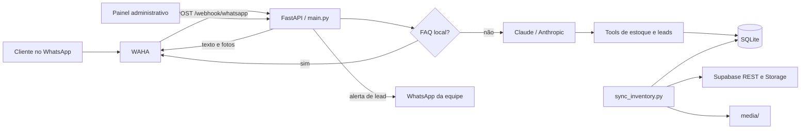

# CarIA

Assistente virtual para revendas de veículos que atende clientes pelo WhatsApp, consulta um espelho local do estoque, qualifica leads e oferece um painel administrativo para a equipe comercial. O piloto atual está configurado para a Company Imports, mas a camada de conectores permite adaptar a origem do estoque para outras lojas.

## O que o projeto entrega

- Atendimento assíncrono por WhatsApp através do WAHA.
- Respostas geradas pelo Claude, com contexto da conversa e uso de ferramentas.
- Busca de veículos por texto, marca, preço, carroceria, câmbio e combustível.
- Consulta da ficha completa e envio das fotos reais do veículo no WhatsApp.
- Cadastro e qualificação progressiva de leads durante a conversa.
- Notificação de novos leads e leads quentes para o telefone da equipe.
- Painel administrativo com dashboard, estoque, lista e kanban de leads, histórico, sincronização e chat de teste.
- Espelho local do estoque e das fotos vindos do Supabase.
- Proteções de sessão, limite de mensagens, rate limiting e silenciamento após transferência ou encerramento.

## Arquitetura e fluxo



O atendimento segue este caminho:

1. O WAHA recebe uma mensagem e chama `POST /webhook/whatsapp`.
2. O backend ignora eventos que não sejam mensagens, mensagens próprias, grupos, conteúdos vazios, números fora da whitelist e textos acima de 1.000 caracteres.
3. Perguntas simples configuradas como FAQ podem ser respondidas sem chamar a IA.
4. As demais mensagens são enviadas ao Claude junto com até 20 mensagens do histórico.
5. O modelo pode chamar ferramentas para buscar o estoque, obter detalhes, solicitar fotos ou criar/atualizar o lead.
6. O backend persiste a conversa e o lead no SQLite, envia a resposta pelo WAHA e, quando necessário, envia fotos e notifica a equipe.

O webhook responde imediatamente e processa o atendimento em uma tarefa assíncrona. O histórico expira após 24 horas de inatividade, há no máximo 20 turnos por sessão e o rate limit padrão permite 8 mensagens em 60 segundos, bloqueando o número por 5 minutos quando excedido.

### Ciclo dos leads

Os status possíveis são `novo`, `qualificado`, `agendado`, `transferido`, `contatado`, `convertido` e `perdido`. A IA controla os estados iniciais e registra informações conforme elas aparecem; a equipe pode movimentar manualmente `agendado`, `transferido`, `contatado`, `convertido` e `perdido` pelo painel.

- `transferido`: o bot permanece em silêncio aguardando atendimento humano.
- `contatado`, `convertido` e `perdido`: encerram a conversa e silenciam o bot.
- Se um cliente de um lead encerrado voltar a escrever, recebe uma mensagem de cortesia, um novo lead é criado e a equipe é avisada.
- Um lead vira `quente` quando combina urgência alta, orçamento ou forma de pagamento e intenção de agendamento.
- Toda mudança de status é registrada com data, autor e observação; alterações automáticas são atribuídas ao usuário especial `IA`.

## Integrações

| Integração | Responsabilidade | Configuração |
| --- | --- | --- |
| Anthropic Claude | Conversação, seleção de ferramentas e qualificação do lead. O modelo configurado no código é `claude-haiku-4-5`. | `ANTHROPIC_API_KEY` |
| WAHA | Receber o webhook do WhatsApp, indicar digitação e enviar textos e imagens. | `WAHA_BASE_URL`, `WAHA_SESSION`, `WAHA_API_KEY`, credenciais do dashboard |
| Supabase PostgREST | Ler `vehicles` e `vehicle_images`, apenas disponíveis e publicados. | `SUPABASE_URL`, `SUPABASE_ANON_KEY` |
| Supabase Storage | Transformar e baixar fotos em WebP para o cache local. | Mesmas credenciais do Supabase |
| SQLite / SQLAlchemy | Persistir lojas, estoque, imagens, conversas, leads, usuários e histórico. | `DATABASE_URL` opcional |
| FastAPI, Jinja2 e JavaScript | API, webhook e painel administrativo renderizado no servidor. | `PORT`, credenciais e segredo de sessão |
| Docker Compose | Executar o WAHA e manter sua sessão em volume persistente. | `.env` e `docker-compose.yml` |
| Nginx e systemd | Proxy reverso e execução contínua no servidor Linux. | Arquivos em `deploy/` |

O Claude nunca recebe bytes de imagem, base64 ou blocos de visão. Ele recebe somente metadados textuais; as fotos são obtidas do cache local (ou da URL remota como fallback) e enviadas diretamente pelo WAHA. Isso mantém o custo de visão fora do fluxo.

## Estrutura do repositório

```text
admin/                    autenticação, rotas e templates do painel
connectors/               contrato de fontes de estoque e conector Supabase
deploy/                   scripts Linux, unidade systemd e configuração Nginx
tests/                    suíte pytest e scripts manuais com IA real
claude_agent.py           cliente Anthropic e loop de tool use
database.py               modelos e operações SQLAlchemy
dealership_config.py      variáveis da loja, FAQ e system prompt
inventory.py              ferramentas de consulta ao estoque local
main.py                   aplicação FastAPI, webhook e integração WAHA
manage_users.py           CLI para usuários adicionais do painel
rate_limit.py             rate limiter em memória
sync_inventory.py         sincronização do Supabase e download de fotos
docker-compose.yml        serviço WAHA
```

Em tempo de execução são criados `db/cariar_bot.db` e `media/`; ambos são ignorados pelo Git.

## Pré-requisitos

- Python 3.10 ou superior.
- `make` (opcional, mas recomendado para os comandos abaixo).
- Docker com Docker Compose v2 para executar o WAHA.
- Uma chave da API Anthropic.
- URL e anon key de um projeto Supabase com as tabelas esperadas pelo conector.
- Um número de WhatsApp que possa ser conectado ao WAHA.

Para produção, também são esperados Linux, systemd e Nginx.

## Instalação local

Com Make:

```bash
make setup
```

Sem Make:

```bash
cp .env.example .env
mkdir -p db media
python -m venv .venv
source .venv/bin/activate        # Windows PowerShell: .venv\Scripts\Activate.ps1
python -m pip install -r requirements.txt
```

Edite o `.env` antes de iniciar. No PowerShell, caso não use o Make, copie o exemplo com `Copy-Item .env.example .env`.

### Variáveis de ambiente

| Variável | Obrigatória | Finalidade / padrão |
| --- | --- | --- |
| `ANTHROPIC_API_KEY` | Sim | Chave da API Anthropic. |
| `SESSION_SECRET_KEY` | Sim | Assina o cookie do painel; a aplicação falha ao iniciar se estiver ausente. Use um valor aleatório forte. |
| `SUPABASE_URL` | Para sincronizar | URL base do projeto Supabase. |
| `SUPABASE_ANON_KEY` | Para sincronizar | Anon key usada em leitura pelo conector. |
| `WAHA_BASE_URL` | Não | URL do WAHA; padrão `http://localhost:8080`. |
| `WAHA_SESSION` | Não | Sessão WAHA; padrão `default`. |
| `WAHA_API_KEY` | Conforme o WAHA | Enviada no header `X-Api-Key`. |
| `WAHA_DASHBOARD_PASSWORD` | Recomendada | Senha do dashboard WAHA. |
| `PORT` | Não | Porta do backend; padrão `3000`. |
| `TIMEZONE_OFFSET_HOURS` | Não | Offset do negócio; padrão `-3` (Brasília). |
| `TEST_PHONES` | Não | Whitelist separada por vírgulas; vazio atende todos os números. Útil no piloto. |
| `DEALERSHIP_NAME` | Não | Nome da loja; usado também ao criar seu registro local. |
| `DEALERSHIP_CITY` | Não | Cidade exibida no atendimento. |
| `DEALERSHIP_PHONE` | Não | Telefone informado aos clientes. |
| `DEALERSHIP_ADDRESS` | Não | Endereço informado aos clientes. |
| `DEALERSHIP_HOURS` | Não | Horário de funcionamento. |
| `DEALERSHIP_STAFF_PHONE` | Recomendada | Número que recebe alertas, no formato `5544999999999`. |
| `ADMIN_USERNAME` | Recomendada | Login bootstrap do painel; padrão `admin`. |
| `ADMIN_PASSWORD` | Sim na prática | Senha do login bootstrap; não possui padrão seguro. |
| `DATABASE_URL` | Não | Padrão `sqlite:///./db/cariar_bot.db`. |

O `.env.example` contém a lista pronta para preenchimento. Não versione o `.env` real.

## Como executar

1. Suba o WAHA:

   ```bash
   make waha-up
   ```

2. Abra `http://localhost:8080/dashboard`, acesse o dashboard e leia o QR Code com o WhatsApp.

3. Sincronize o estoque e as fotos:

   ```bash
   make sync
   ```

4. Inicie a API:

   ```bash
   make run
   ```

5. Verifique:

   - API e painel: `http://localhost:3000`
   - Login administrativo: `http://localhost:3000/admin/login`
   - Health check: `http://localhost:3000/health`
   - Documentação OpenAPI: `http://localhost:3000/docs`

O `docker-compose.yml` configura o WAHA para enviar eventos `message` a `http://host.docker.internal:3000/webhook/whatsapp`.

### Painel administrativo

Depois do login, o painel oferece:

- métricas do funil, veículos mais procurados e leads quentes;
- estoque sincronizado;
- leads em lista ou kanban, com busca e filtros;
- detalhe do lead, conversas e histórico de status;
- sincronização manual do estoque;
- chat interno que usa a mesma IA do atendimento real e, portanto, consome a API Anthropic.

O login definido no `.env` funciona como acesso bootstrap. Também é possível criar logins individuais, atualmente sem níveis distintos de permissão:

```bash
make user-add USER=joao PASSWORD='senha-forte' NAME='João Vendedor'
make user-list
```

## Comandos do Makefile

Execute `make help` para a lista atualizada. Os principais alvos são:

| Comando | Ação |
| --- | --- |
| `make setup` | Cria `.env` se necessário, diretórios, virtualenv e instala dependências. |
| `make install` | Instala/atualiza as dependências no virtualenv. |
| `make run` | Inicia o backend em modo de desenvolvimento. |
| `make serve` | Inicia Uvicorn sem reload, adequado para uma execução local estável. |
| `make sync` | Importa estoque e fotos do Supabase. |
| `make test` | Executa apenas a suíte automatizada, sem chamadas reais à IA. |
| `make check` | Compila os módulos e roda a suíte automatizada. |
| `make waha-up/down/logs/restart` | Opera o container WAHA. |
| `make user-add`, `make user-list` | Gerencia logins individuais do painel. |

Os alvos `chat-manual`, `scenarios-manual` e `eval-prompt` chamam a Anthropic de verdade e só executam com confirmação explícita, por exemplo:

```bash
make chat-manual CONFIRM_AI_COST=1
```

## Testes

A suíte automatizada usa um SQLite temporário, mocka `get_ai_response` nos fluxos de mensagem e não depende de rede nem consome tokens:

```bash
make test
# ou
.venv/bin/python -m pytest tests -q
```

Ela cobre busca de estoque, datas de visita, autenticação, segurança de sessão, rate limiting, painel/kanban, histórico e ciclo de status dos leads.

Os arquivos `tests/chat_manual.py`, `tests/scenarios_manual.py` e `tests/eval_prompt.py` são avaliações manuais com a API real. Não são coletados pelo pytest e geram custo.

## Persistência e sincronização

O banco é criado automaticamente pelo SQLAlchemy na importação de `database.py`; não há ferramenta de migrations no projeto. A sincronização faz upsert dos veículos pelo `slug`, substitui a relação de imagens, baixa novas fotos em até oito threads e registra a última sincronização. O bot nunca consulta o Supabase durante uma conversa: toda busca usa exclusivamente o SQLite local.

Como o sincronizador importa os registros disponíveis, mas não remove explicitamente do SQLite veículos que desapareceram da resposta da origem, vale monitorar essa regra caso a remoção imediata de itens vendidos seja um requisito operacional.

Faça backup de `db/` para preservar leads, usuários, conversas e histórico. `media/` pode ser reconstruído por uma nova sincronização.

## Produção

Os scripts assumem o projeto em `/opt/cariar` e devem ser executados como usuário com permissão administrativa:

```bash
bash deploy/setup_server.sh   # uma vez: pacotes, Docker, firewall e diretórios
bash deploy/start.sh          # virtualenv, WAHA, systemd e Nginx
bash deploy/update.sh         # dependências, sincronização e restart da API
```

O serviço systemd executa `uvicorn main:app` na porta 3000. O Nginx encaminha `/` para a API e `/waha/` para o dashboard WAHA. Antes de expor a instalação, use credenciais fortes, restrinja o painel, configure HTTPS (Certbot já é instalado pelo setup) e revise firewall e acesso ao dashboard WAHA.

## Limitações conhecidas

- A configuração e a sincronização operam com uma loja por instalação, embora o modelo de dados já tenha `dealership_id`.
- Os usuários administrativos ainda não possuem papéis ou permissões diferentes.
- O rate limiter fica em memória e não é compartilhado entre processos ou servidores.
- O agendamento registra a preferência de data/período, mas não integra uma agenda externa.
- Não há migrations nem rotina automática de backup.
- O webhook não autentica uma assinatura própria; a exposição deve ser protegida pela infraestrutura e pelas configurações do WAHA.
